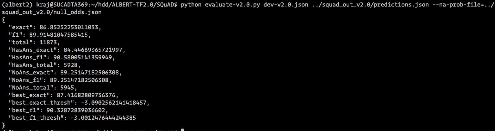

# ALBERT-TF2.0
ALBERT model Fine Tuning using TF2.0

This repository contains TensorFlow 2.0 implementation for ALBERT.

## Requirements
- python3
- pip install -r requirements.txt

## ALBERT Pre-training
ALBERT model pre-training from scratch and Domain specific fine-tuning. Instructions [here](./pretraining.md)

## Download ALBERT TF 2.0 weights

|                                   Verison 1                                   |                                   Version 2                                   |
|:-----------------------------------------------------------------------------:|:-----------------------------------------------------------------------------:|
|   [base](https://drive.google.com/open?id=1WDz1193fEo8vROpi-hWn3hveMmddLjpy)  |   [base](https://drive.google.com/open?id=1FkrvdQnJR9za9Pv8cuiEXd1EI2hxx31a)  |
|  [large](https://drive.google.com/open?id=1j4ePHivAXHNqqNucZOocwlkyneQyUROl)  |  [large](https://drive.google.com/open?id=1xADTTjwTogFmnhNU3EPJ86slykoSL4L7)  |
|  [xlarge](https://drive.google.com/open?id=10o7l7c7Y5UlkSQmFca0_iaRsGIPmJ5Ya) |  [xlarge](https://drive.google.com/open?id=1GsAU_RqO8Pl7oPecj0opjA-4ktI8-4oX) |
| [xxlarge](https://drive.google.com/open?id=1gl5lOiAHq29C_sG6GoXLeZJHKDD2Gfju) | [xxlarge](https://drive.google.com/open?id=1JtQcGKtt0QZThXS1jz2v5x72TrYYjg8N) |

unzip the model inside repo.

Above weights does not contain the final layer in original model. Now can only be used for fine tuning downstream tasks.

For full Weights conversion from TF-HUB to TF 2.0 [here](./converter.md)

## Download glue data
Download using the below cmd

```bash
python download_glue_data.py --data_dir glue_data --tasks all
```

## Fine-tuning
To prepare the fine-tuning data for final model training, use the
[`create_finetuning_data.py`](./create_finetuning_data.py) script.  Resulting
datasets in `tf_record` format and training meta data should be later passed to
training or evaluation scripts. The task-specific arguments are described in
following sections:

### Creating finetuninig data
* Example CoLA

```bash
export GLUE_DIR=glue_data/
export ALBERT_DIR=large/

export TASK_NAME=CoLA
export OUTPUT_DIR=cola_processed
mkdir $OUTPUT_DIR

python create_finetuning_data.py \
 --input_data_dir=${GLUE_DIR}/ \
 --spm_model_file=${ALBERT_DIR}/vocab/30k-clean.model \
 --train_data_output_path=${OUTPUT_DIR}/${TASK_NAME}_train.tf_record \
 --eval_data_output_path=${OUTPUT_DIR}/${TASK_NAME}_eval.tf_record \
 --meta_data_file_path=${OUTPUT_DIR}/${TASK_NAME}_meta_data \
 --fine_tuning_task_type=classification --max_seq_length=128 \
 --classification_task_name=${TASK_NAME}
```

### Running classifier

```bash
export MODEL_DIR=CoLA_OUT
python run_classifer.py \
--train_data_path=${OUTPUT_DIR}/${TASK_NAME}_train.tf_record \
--eval_data_path=${OUTPUT_DIR}/${TASK_NAME}_eval.tf_record \
--input_meta_data_path=${OUTPUT_DIR}/${TASK_NAME}_meta_data \
--albert_config_file=${ALBERT_DIR}/config.json \
--task_name=${TASK_NAME} \
--spm_model_file=${ALBERT_DIR}/vocab/30k-clean.model \
--output_dir=${MODEL_DIR} \
--init_checkpoint=${ALBERT_DIR}/tf2_model.h5 \
--do_train \
--do_eval \
--train_batch_size=16 \
--learning_rate=1e-5 \
--custom_training_loop
```

By default run_classifier will run 3 epochs. and evaluate on development set

Above cmd would result in dev set `accuracy` of `76.22` in CoLA task

The above code tested on TITAN RTX 24GB single GPU


### SQuAD

#### Data and Evalution scripts
*   [train-v1.1.json](https://rajpurkar.github.io/SQuAD-explorer/dataset/train-v1.1.json)
*   [dev-v1.1.json](https://rajpurkar.github.io/SQuAD-explorer/dataset/dev-v1.1.json)
*   [evaluate-v1.1.py](https://github.com/allenai/bi-att-flow/blob/master/squad/evaluate-v1.1.py)
*   [train-v2.0.json](https://rajpurkar.github.io/SQuAD-explorer/dataset/train-v2.0.json)
*   [dev-v2.0.json](https://rajpurkar.github.io/SQuAD-explorer/dataset/dev-v2.0.json)
*   [evaluate-v2.0.py](https://worksheets.codalab.org/rest/bundles/0x6b567e1cf2e041ec80d7098f031c5c9e/contents/blob/)

#### Training Data Preparation
```bash
export SQUAD_DIR=SQuAD
export SQUAD_VERSION=v1.1
export ALBERT_DIR=large
export OUTPUT_DIR=squad_out_${SQUAD_VERSION}
mkdir $OUTPUT_DIR

python create_finetuning_data.py \
--squad_data_file=${SQUAD_DIR}/train-${SQUAD_VERSION}.json \
--spm_model_file=${ALBERT_DIR}/vocab/30k-clean.model  \
--train_data_output_path=${OUTPUT_DIR}/squad_${SQUAD_VERSION}_train.tf_record  \
--meta_data_file_path=${OUTPUT_DIR}/squad_${SQUAD_VERSION}_meta_data \
--fine_tuning_task_type=squad \
--max_seq_length=384
```

### Running Model
```bash

python run_squad.py \
--mode=train_and_predict \
--input_meta_data_path=${OUTPUT_DIR}/squad_${SQUAD_VERSION}_meta_data \
--train_data_path=${OUTPUT_DIR}/squad_${SQUAD_VERSION}_train.tf_record \
--predict_file=${SQUAD_DIR}/dev-${SQUAD_VERSION}.json \
--albert_config_file=${ALBERT_DIR}/config.json \
--init_checkpoint=${ALBERT_DIR}/tf2_model.h5 \
--spm_model_file=${ALBERT_DIR}/vocab/30k-clean.model \
--train_batch_size=48 \
--predict_batch_size=48 \
--learning_rate=1e-5 \
--num_train_epochs=3 \
--model_dir=${OUTPUT_DIR} \
--strategy_type=mirror
```

### Runnig SQuAD V2.0

```bash
export SQUAD_DIR=SQuAD
export SQUAD_VERSION=v2.0
export ALBERT_DIR=xxlarge
export OUTPUT_DIR=squad_out_${SQUAD_VERSION}
mkdir $OUTPUT_DIR
```

```bash
python create_finetuning_data.py \
--squad_data_file=${SQUAD_DIR}/train-${SQUAD_VERSION}.json \
--spm_model_file=${ALBERT_DIR}/vocab/30k-clean.model  \
--train_data_output_path=${OUTPUT_DIR}/squad_${SQUAD_VERSION}_train.tf_record  \
--meta_data_file_path=${OUTPUT_DIR}/squad_${SQUAD_VERSION}_meta_data \
--fine_tuning_task_type=squad \
--max_seq_length=384
```

```bash
python run_squad.py \
--mode=train_and_predict \
--input_meta_data_path=${OUTPUT_DIR}/squad_${SQUAD_VERSION}_meta_data \
--train_data_path=${OUTPUT_DIR}/squad_${SQUAD_VERSION}_train.tf_record \
--predict_file=${SQUAD_DIR}/dev-${SQUAD_VERSION}.json \
--albert_config_file=${ALBERT_DIR}/config.json \
--init_checkpoint=${ALBERT_DIR}/tf2_model.h5 \
--spm_model_file=${ALBERT_DIR}/vocab/30k-clean.model \
--train_batch_size=24 \
--predict_batch_size=24 \
--learning_rate=1.5e-5 \
--num_train_epochs=3 \
--model_dir=${OUTPUT_DIR} \
--strategy_type=mirror \
--version_2_with_negative \
--max_seq_length=384
```
Experiment done on 4 x NVIDIA TITAN RTX 24 GB.
#### Result


### Multi-GPU training and XLA

- Use flag `--strategy_type=mirror` for Multi GPU training. Currently All the existing GPUs in the environment will be used.
- Use flag `--enable-xla` to enable XLA. Model training starting time will be increase.(JIT compilation)

### Ignore
Below warning will be displayed if you use keras model.fit method at end of each epoch. Issue with training steps calculation when `tf.data` provided to `model.fit()`
Have no effect on model performance so ignore. Mostly will fixed in the next tf2 relase . [Issue-link](https://github.com/tensorflow/tensorflow/issues/25254)
```
2019-10-31 13:35:48.322897: W tensorflow/core/common_runtime/base_collective_executor.cc:216] BaseCollectiveExecutor::StartAbort Out of range:
End of sequence
         [[{{node IteratorGetNext}}]]
         [[model_1/albert_model/word_embeddings/Shape/_10]]
2019-10-31 13:36:03.302722: W tensorflow/core/common_runtime/base_collective_executor.cc:216] BaseCollectiveExecutor::StartAbort Out of range:
End of sequence
         [[{{node IteratorGetNext}}]]
         [[IteratorGetNext/_4]]
```


## References
1. TensorFlow offical implementation of [BERT](https://github.com/tensorflow/models/tree/master/official/nlp/bert) in TF 2.0 . Lot of parts of code in this repo adapted from the above repo.
2. LAMB optimizer from TensorFlow [addons](https://github.com/tensorflow/addons/blob/master/tensorflow_addons/optimizers/lamb.py)
3. TF-HUB weights to TF 2.0 weights conversion : [KPE](https://github.com/kpe/bert-for-tf2)
